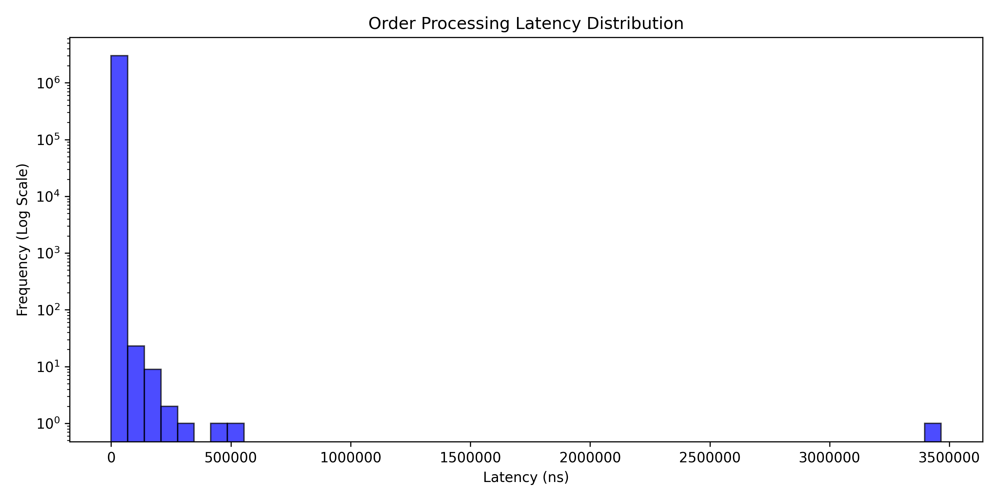
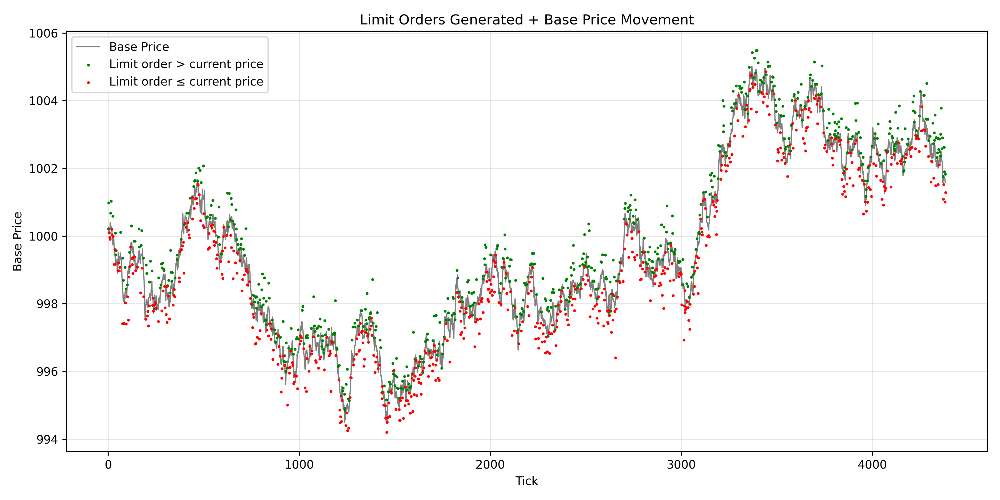

# Order Book Matching Engine

A high-performance, single-threaded C++ order book matching engine built for low-latency order matching. This project demonstrates optimized matching logic and efficient order book data structures, achieving sub-microsecond latency on modern hardware.

The matching engine processes buy and sell orders, matches them at the best available prices using price-time priority, and maintains an efficient limit order book data structure. It supports limit orders, market orders, and order cancellations, which are the core operations required for electronic trading systems.

**Latency Metrics (40M orders)**
- Average: 163 ns
- P50: 142 ns
- P99: 396 ns
- Throughput: 5.13M orders/sec


_Order processing latency distribution (log scale)_

The latency distribution is heavily skewed toward the lower end. Outliers are rare (10-100 occurrences per 40M orders) and likely caused by hardware interrupts or other background processes.

Read more about the performance and benchmark details in the [Performance](#performance) section below.

**Note:** These metrics measure matching engine performance exclusively. In production systems, network latency, serialization, and system overhead add significant delay beyond these results.

## Features

### Place order
Places and executes a new order using price-time priority. 

**Order types**
- Limit order
- Market order

### Cancel order
Removes order from limit order book.

_Note: the modify-order operation has been left out for simplicity. Modifying an order can simply be treated as a cancel + place order. You would lose your place in the time-priority queue this way, but that is what happens in real exchanges most of time anyway._

## Optimizations & Design

todo

## Performance
Our benchmark generates 100M synthetic orders, using the first 50M to populate the order book and the remaining 50M to measure performance. The benchmark runs with forced cold cache for each new order to provide realistic performance characteristics (using  `_mm_clflush`).

| Metric | Value |
| :--- | ---: |
| Average Latency | 164 ns |
| P50 Latency | 144 ns |
| P99 Latency | 401 ns |
| Min Latency | 28 ns |
| Max Latency* | 557,398 ns |
| Throughput | 5.12M orders/sec |

_*Such high max latency might be caused by hardware interrupts, context switches, or other background processes on the machine. Or simply by rare cache misses or other implementation details. Further investigation is needed to pinpoint the exact cause._


_Order processing latency distribution (log scale)_

As you can see, the latency distribution is heavily skewed towards the lower end. However, there are some outliers that take significantly longer. The frequencies of these outliers are in the order of 10 to 100, which is extremely low compared to the total number of orders processed (40M).

**Important:** These metrics measure only the matching engine's latency. In real-world systems, network latency, serialization/deserialization, and other system overhead add significant delay. These results capture purely the time to process an order and update the order book.

### Benchmark Data
The benchmark uses synthetic order data created with 5 different distributions, simulating a realistic market. Prices are rounded to 2 decimal places, which causes limit orders to group at discrete price levels, resulting in realistic order book depth. The grey line represents the generated base price, which acts as a reference for limit orders placed at different distances around it. Market and cancel orders are also generated and included in the dataset.


_Small snippet of price movement and limit orders generated by the syntethic order generator_

**Note:** This synthetic order generator provides a realistic approximation, although it doesn't capture all nuances of real-world markets.

## Testing

The project includes unit tests for the order book implementation, covering core functionalities such as adding orders, matching orders, and canceling orders. See the `tests` folder for test cases and expected outcomes.

## Dependencies & Tooling
**Language:** C++20

**Build System:** CMake (version 4.2)

**Testing:** CTest (version 4.2)

### Development

**Formatter:** Clang-Format (Google Style, see `/.clang-format`)

**Linter:** Clang-Tidy (see `.clang-tidy`) 

## Build and Run

### Prerequisites
- **C++20 compiler** (MSVC, GCC, Clang, etc)
- **CMake**

    Download, run installer, select `Add CMake to system PATH`

### Build & Run Benchmark
Use the following commands to build and run the benchmark (`/benchmark`). Uses `Release` build type for compiler optimizations.

_Linux_
```powershell
> cmake -S . -B build_release -DCMAKE_BUILD_TYPE=Release
> cmake --build build_release
> ./build_release/benchmark_engine
```

### Build & Run Tests
Use the following commands to build and run the tests (`/tests`).

_Linux_
```powershell
> cmake -S . -B build_debug -DCMAKE_BUILD_TYPE=Debug
> cmake --build build_debug
> ./build_debug/test_engine # run tests directly, or
> ctest --test-dir build_debug # run tests via ctest
```

### Build & Run During Development
Modify the `src/main.cpp` file to test individual features during development, which will be compiled into the `run_engine.exe` file.

_Linux_
```powershell
> cmake -S . -B build_debug -DCMAKE_BUILD_TYPE=Debug
> cmake --build build_debug
> ./build_debug/run_engine
```

## File Structure

```bash
│   .clang-format
│   .clang-tidy
│   .gitignore
│   CMakeLists.txt
│   README.md
├───benchmarks
│       bench_matching_engine.cpp
├───docs
│       diagrams.txt
├───include
│   ├───common
│   │       Types.hpp
│   └───matching_engine
│           Order.hpp
│           OrderBook.hpp
├───scripts
│       dashboard.py
├───src
│   │   main.cpp
│   └───matching_engine
│           Order.cpp
│           OrderBook.cpp
└───tests
        test_order_book.cpp
```

Use the following command to update file structure (Windows), make sure that the /build folder is deleted:
```
tree /f
```

blah blah short explanation about file structure

## Contribute

### Extra / Optional Tools
- **LLVM** (for Clang-Format and Clang-Tidy)

    Download, run installer, select `Add LLVM to system PATH`
- **VS Code**

    Install VS Code and use extensions: `C/C++`, `CMake Tools` and `clangd` (make sure to disable IntelliSense for clangd to work)

### Set up Clang-Format in VS Code
Clang-Format is used for formatting the code. This guarantees that code is consistent across all files (spacing, tab size, etc)

1. Go to settings, search for "Format on Save", and turn it on.
3. Open a .cpp file and hit `Ctrl+Shift+P`
4. Search for "Format Document With", click it and press `Configure Default Formatter...` and select `clangd`.
3. Hit `Ctrl+S` to save and the code gets formatted.

### Naming Conventions
| Type | Convention | Example |
| :--- | :---: | ---: |
| Classes | PascalCase | `OrderBook`, `MatchingEngine` |
| Methods | PascalCase | `AddOrder()`, `CancelOrder()` |
| Variables | snake_case | `price_level`, `order_id` |
| Member Vars | snake_case + trailing _ | `best_bid_`, `orders_` |
| Files | snake_case | `order_book.cpp`, `tcp_server.hpp` |
| Namespaces | snake_case | `namespace exchange_core` |
| Constants | kPascalCase | `kMaxOrderSize`, `kDefaultPort` |

## License

???

---

**Interested in more information or details?** Reach out to me on [LinkedIn](https://linkedin.com/in/tiespetersen), would love to answer questions and connect!


<!-- ## Project Report
Do you want all the details about the implementation of the matching engine, techniques and optimizations used, and a detailed performance analysis? View or download the project report:

Project Report (Coming soon) ( View | Download )

_Found it interesting? Feel free to share it with friends or colleagues who might enjoy or benefit from it. Thank you ;)_

## Blog

Do you want more details about the build process, development and visualizations of the algorithms and data structures? Read my blog posts with visualizations, explanations, and more:

- #1 : (Coming soon)
- #2 : (Coming soon)

_Enjoyed the blog? Feel free to share it with friends or colleagues who might enjoy or benefit from it. Thank you ;)_ -->